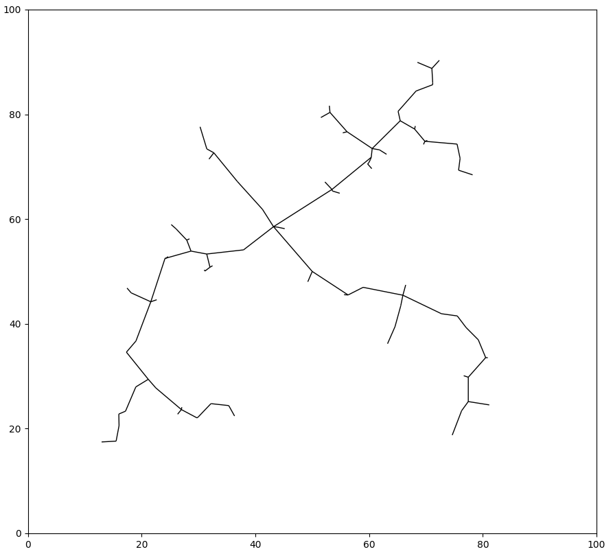

# Path Planning - RRT Algorithm
This repo contains the implementations and results of the RRT path planning algorithm that are completed during Northwestern MSR Hackathon.

The Rapidly-Exploring Random Tree (RRT) is proposed by Dr. Steve LaValle in 1998. It is a popular algorithm for robot path planning that enables rapid path search in high-dimensional spaces by establishing a space-filling tree.

## Basic RRT
[RRT_1_path_generate.py](./RRT_1_path_generate.py) generates a single RRT without obstacles in the 2D map.

The following figures show the RRT running for 100, 1000 and 10000 iterations, respectively.

  
  
  

## RRT with Circular Objects
[RRT_2_circular_objects.py](./RRT_2_circular_objects.py) tries to find a path from the start point (blue star) to the target point (red star) in a map filled with randomly generated circular obstacles.

The circles are defined by its center position and radius. Collisions are detected using Euclidean distance between the line and the circle centers.

Here is a example of successful path generated by RRT:

  

## RRT with Arbitrary Objects
[RRT_3_arbitrary_objects.py](./RRT_3_arbitrary_objects.py) attempts to find a path from the start point (blue star) to the target point (red star) in a binary map of arbitrary objects. Here, I am using a Northwestern style N-shaped map, where the letter "N" is the obstacle.

The lines in the RRT are discretized into segments and the collosions are detected pixel by pixel.

Here is a example of successful path generated by RRT:

  

